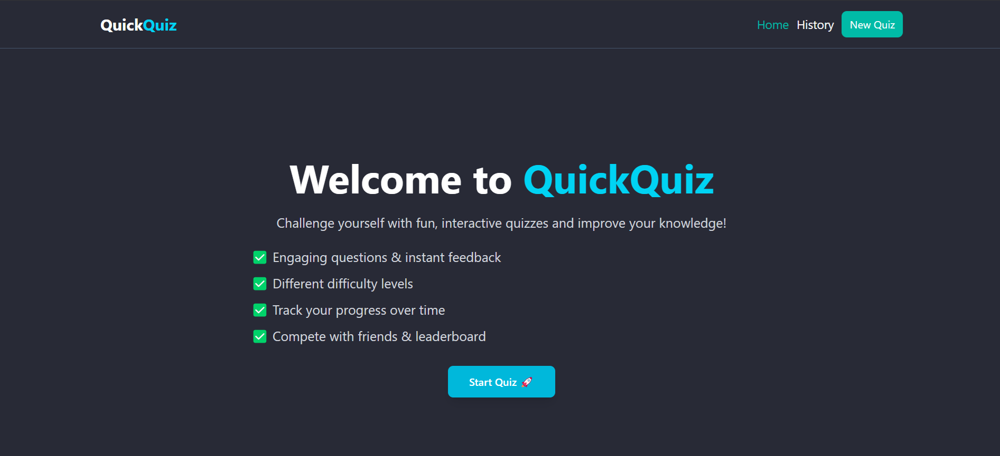
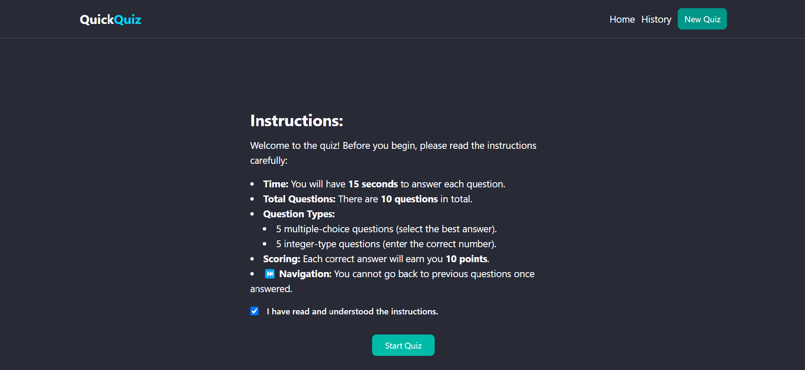
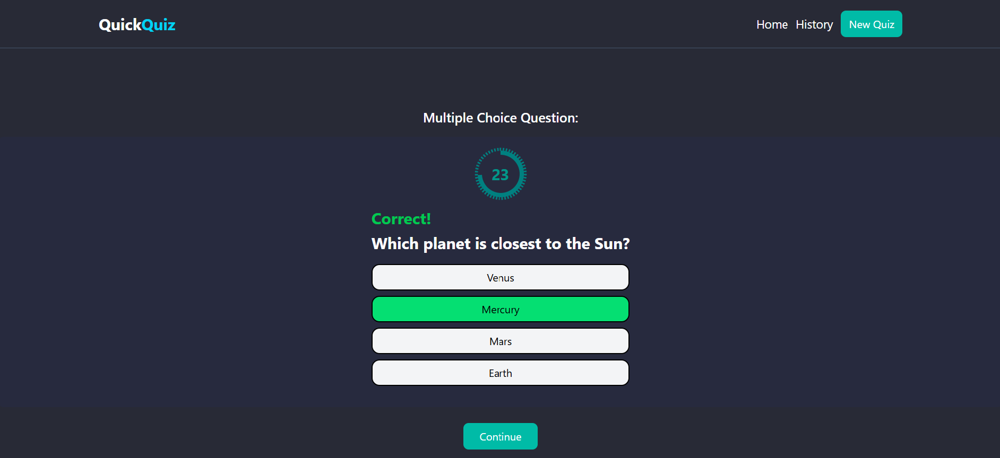
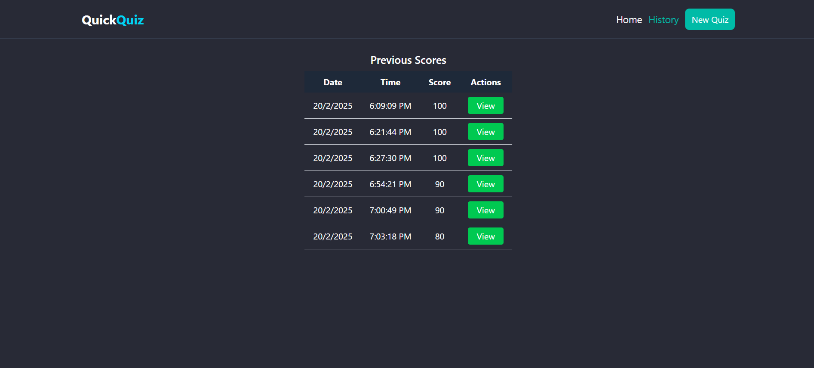
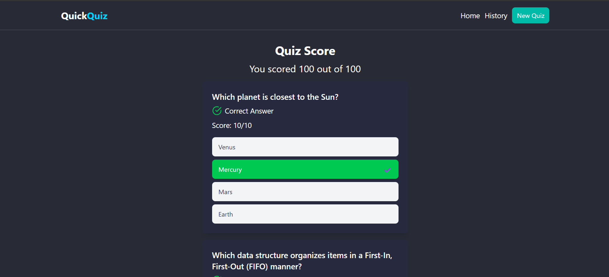

# Quick Quiz

Quick Quiz is a fully responsive quiz application built with React,  Tailwind CSS, and Framer Motion. It provides an interactive and engaging quiz experience while storing user progress using IndexedDB.

## Project Setup Instructions

### Prerequisites

Ensure you have the following installed:

- Node.js
- npm

## Cloning
To clone this repository to your local machine, open a new folder and run the following command in terminal:

```bash
git clone https://github.com/avinashkt04/Quick-Quiz.git
cd Quick-Quiz
```

### App Setup


1. Install dependencies:
   ```sh
   npm install
   ```

2. Start the vite app:
   ```sh
   npm run dev
   ```

The frontend should now be running on `http://localhost:5173`

---

## Features

- **Fully Responsive:** Works seamlessly across all devices.
- **Smooth Animations:** Powered by Framer Motion for an engaging user experience.
- **IndexedDB Support:** Stores quiz history and submissions for offline access.
- **Tailwind CSS Styling:** Provides a modern and clean UI.

---


## Screenshots


### Home Page



### Instruction Page



### Quiz Page



### History Page




### Submission Page

